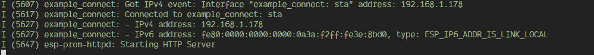

# esp-prom
[](https://docs.espressif.com/projects/esp-idf/en/v4.4/)
[](LICENSE)


Run a Prometheus monitoring endpoint on an ESP32 or other Espressif microcontroller. Increase
obervability in your project while you develop, by monitoring heap memory, FreeRTOS task stack size, and other helpful metrics.  For use with the [Espressif IoT Development Framework](https://www.espressif.com/en/products/sdks/esp-idf) (ESP-IDF).

This is an implementation of [digitalocean/prometheus-client-c](https://github.com/digitalocean/prometheus-client-c), with `esp_http_server` from ESP-IDF to serve the endpoint.

### Usage

Clone this repository, e.g.:
```bash
cd ~/myprojects/esp
git clone https://github.com/nated0g/esp-prom
```

Add path to components in [CMakeLists.txt](https://docs.espressif.com/projects/esp-idf/en/latest/esp32/api-guides/build-system.html):
```CMake
cmake_minimum_required(VERSION 3.5)
set(EXTRA_COMPONENT_DIRS /home/user/myprojects/esp/esp-prom/components)
include($ENV{IDF_PATH}/tools/cmake/project.cmake)
project(my-esp-project)
```

#### Example
Check the `/examples` directory for a simple example using the default metrics
you can flash to an ESP32.

Configure project with `idf.py menuconfig` to add WiFi credentials, then build and flash.  View the logs to get the IP address of the device.  You'll need this to set up a Prometheus scraper.
```bash
cd ~/myprojects/esp/esp-prom/examples/simple
idf.py menuconfig
idf.py build
idf.py flash
idf.py monitor
```


Make note of the IP address of the device.
### Prometheus/Grafana Setup
Included in this repository is a simple Prometheus/Grafana setup in a 
`docker-compose.yml` file, along with some neccesary configuration files.

Installing Docker is outside of the scope of this document, you can learn about that here: 
[Get Docker](https://docs.docker.com/get-docker/). 

Edit `docker/prometheus/prometheus.yml` with the IP address of your device.

```yaml
...
  - job_name: 'esp32'
    
    static_configs:
      - targets: ['192.168.1.178']
```

Start the containers with `docker-compose up`.

Prometheus will be served on `localhost:9090`, and Grafana will be served on
`localhost:3000`.

Set up some dashboards in Grafana and enjoy the added visibility into your
firmware!

### To do:
* Add a default dashboard to Grafana
* Add docs for adding user defined metrics 
* Add more default metrics