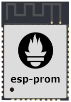

# esp-prom

Run a Prometheus monitoring endpoint on an ESP32 or other Espressif microcontroller. Increase
obervability in your project while your develop by monitoring heap memory, FreeRTOS task stack size, or other useful metrics.  For use with the Espressif IoT Development Framework (ESP-IDF.)

